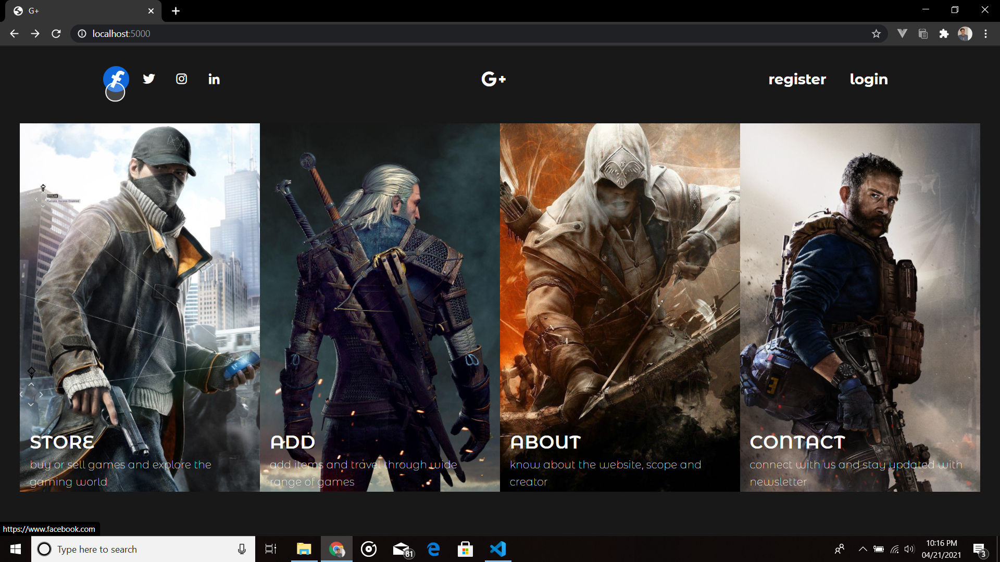
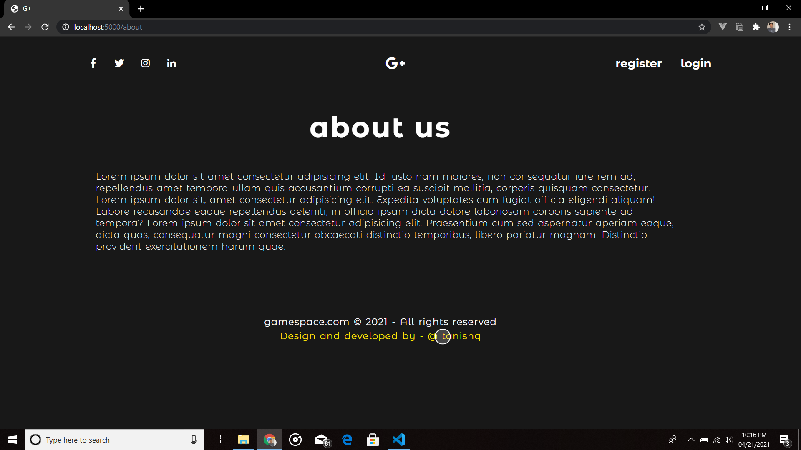
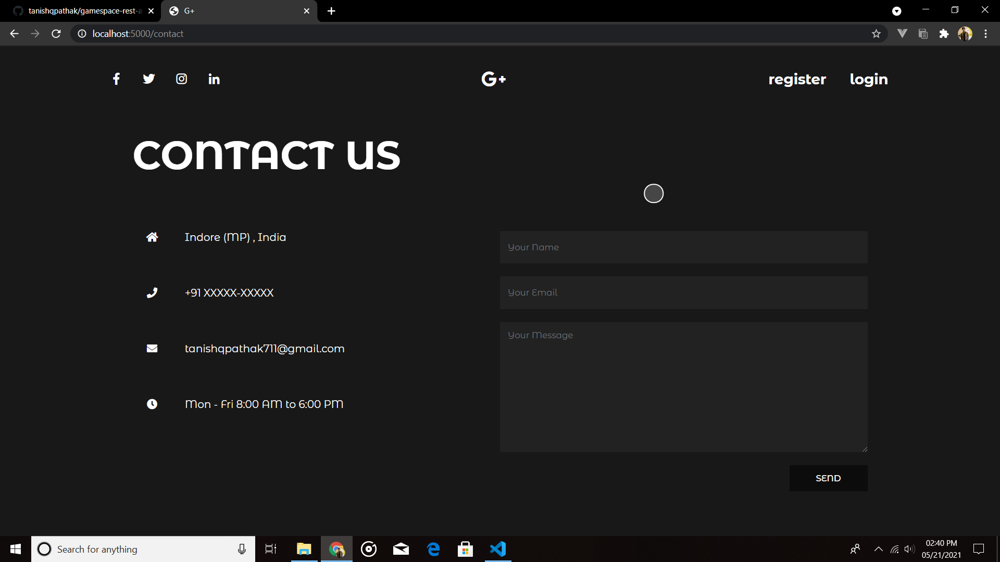
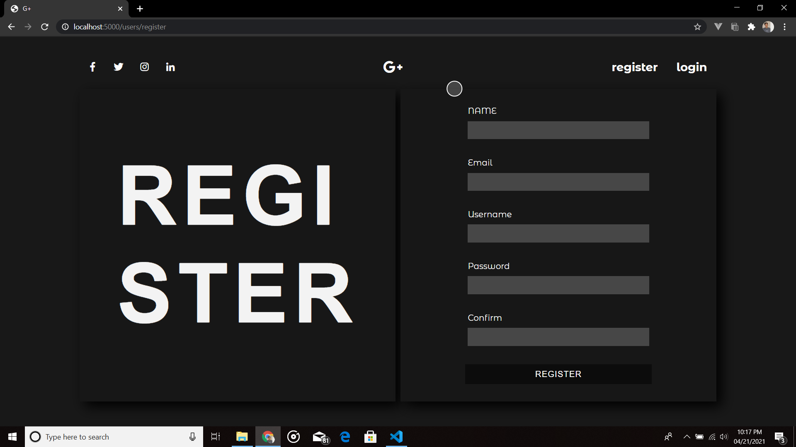
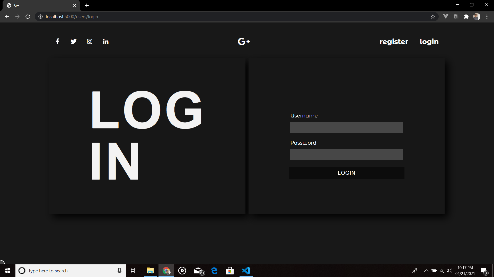
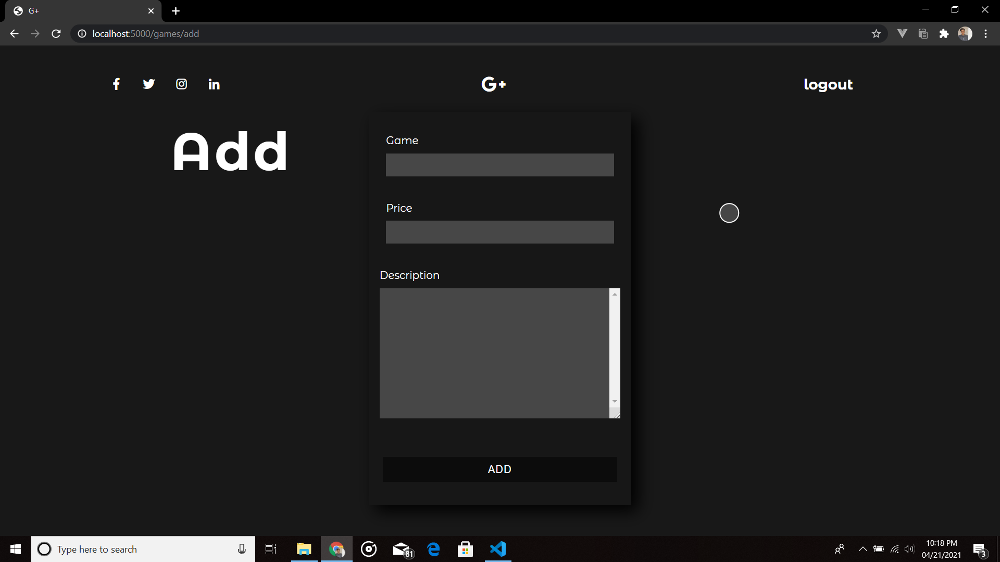

# Demo REST-API server
Demo rest-api built on Node.js , Express.js and MongoDB with Passport.js authentication for login along with Pug Templating Engine for Frontend Rendering.
Is a demo rest-api server where any user can create account and post an ad of any game,where routes protected with express validations and Hashing algorithm for passwords of users.

## Screenshots

